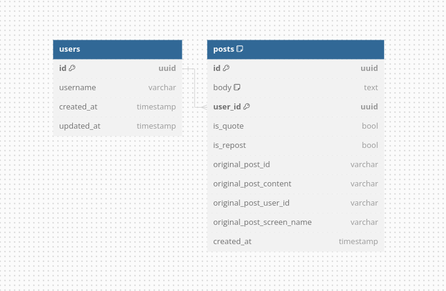

# Go Simple Twitter Clone

This project stems from my endeavor to learn Go. It mirrors another project created with NestJS, which you can find [here](https://github.com/dexfs/challenge-twitter-clone)

I'm actively learning and applying new knowledge as needed.

Please feel free to comment and offer suggestions for improvement on anything here.

## Database Model
https://dbdiagram.io/d/go-twitter-clone-660b4e8437b7e33fd741027f

## Endpoints

### Users
___
**GET** /users/*:username*/feed

**GET** /users/*:username*/info

### Posts
___
**GET** /posts?user_id=UUID

**POST** /posts - '{"content": "Post Content", "user_id": "uuid"}'

**POST** /posts/repost - '{"content": "Post Content", "user_id": "uuid", "post_id": "UUID"}'

**POST** /posts/quote - '{"content": "Post Content", "user_id": "uuid", "post_id": "UUID"}'

## Styleguide 

[uber go style guide](https://github.com/alcir-junior-caju/uber-go-style-guide-pt-br)
